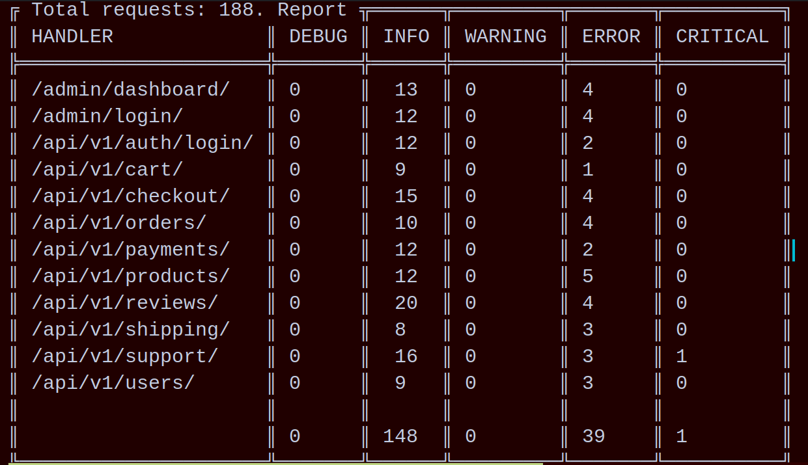

# Анализ журнала логирования

Нужно написать cli-приложение, которое будет анализировать логи django-приложения и формировать отчеты. Отчет выводится в консоль. Интерфейс приложения:
можно передать пути к логам, файлов может быть несколько
можно указать аргумент --report c названием отчета который нужно сформировать
Пример формирование отчёта:
```commandline
python3 main.py logs/app1.log logs/app2.log logs/app3.log --report handlers
```

## Как формируется отчет на основе нескольких файлов?
- Каждый файл обрабатывается отдельно, а после обработки данные объединяются в один отчёт. Например, нужно посчитать общее количество запросов: в файле app1.log — 3 млн запросов, а в файле app2.log — 2 млн запросов, итого в отчете будет 5 млн запросов.
## Какие отчеты нужны?
- Нужно реализовать только один отчет, но нужно заложить в архитектуру возможность работы с несколькими отчетами.
- Отчёт о состоянии ручек API по каждому уровню логирования:
- название отчета: handlers

## Aлгоритм формирования:
считаем количество запросов к ручкам, это записи django.requests:
по каждой ручке
по каждому уровню логирования
группируем запросы по ручкам
при выводе сортируем ручки в алфавитном порядке
последней строчкой выводим общее количество запросов
Пример формирование отчёта:
```
python3 main.py logs/app1.log logs/app2.log logs/app3.log --report handlers
```
Пример вывода:
```
Total requests: 1000

HANDLER               	DEBUG  	INFO   	WARNING	ERROR  	CRITICAL  
/admin/dashboard/     	20     		72     	19     		14     		18  	 
/api/v1/auth/login/   	23     		78     	14     		15     		18  	 
/api/v1/orders/       	26     		77     	12     		19     		22  	 
/api/v1/payments/     	26     		69     	14     		18     		15  	 
/api/v1/products/     	23     		70     	11     		18     		18  	 
/api/v1/shipping/     	60     		128    	26     		32     		25  	 
                        	178    		494    	96     		116    		116
```
## Какие функциональные требования?
# Основные:
- можно сформировать отчёт handlers на основе нескольких файлов
- пути к файлам передается как аргумент
- название отчета передается как аргумент
# Дополнительные:
- приложение проверяет что указанные файлы существуют
- приложения проверяет что переданное имя отчета верное


## Запуск скрипта

```commandline
logs/app1.log logs/app2.log wrongfile logs/app3.log --report Report
```

## Пример отчета:  



## Цели проекта

Код написан в учебных целях